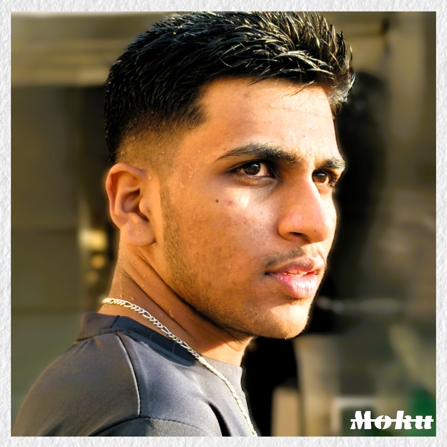

# MOHAN KUMAR S
### Full Stack Developer | Software Engineer | AI Enthusiast

  

## 👨‍💻 About Me
Passionate technology professional with expertise in Web Development. Focused on delivering scalable solutions and driving innovation through technology. Currently pursuing Computer science in SDM IT

## 🌐 Connect With Me

## 🛠️ Technical Skills

### Programming Languages

### Frontend Development

### Backend Development

### Database

## 📈 GitHub Stats

  
  

## 🎓 Education
- **Pre University** in [P C M B]
  - KSEAB, 2022
  - Percentage: 92.5%
- **Bachelor's Degree** in [Computer Science and Engineering]
  - Visvesvaraya Technological University, 2022-current Date
  - GPA: 8.88
